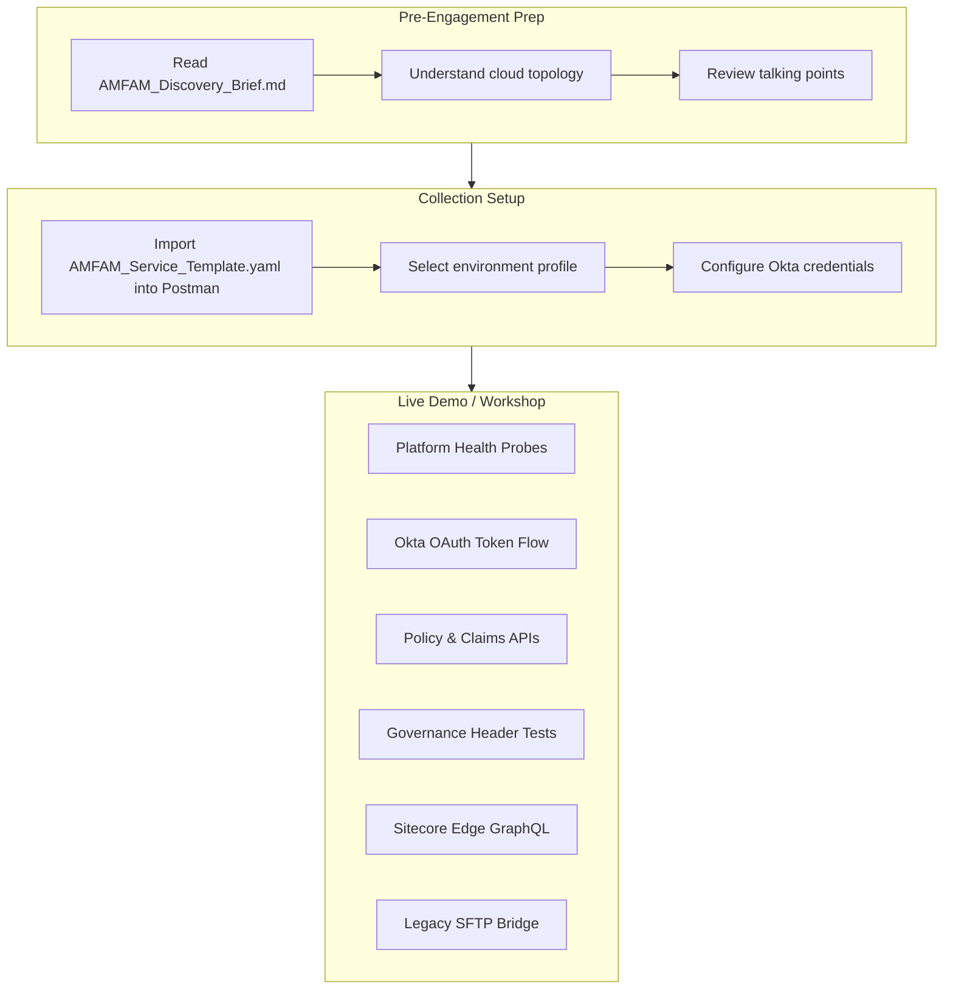
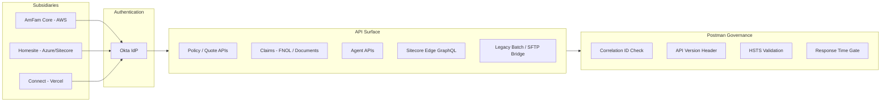

# Cust-AMFAM-engagement-kit

Pre-built engagement artifacts for **American Family Insurance (AMFAM)**, designed to accelerate Postman Customer Success discovery calls and technical workshops.

## How It Works

## AMFAM Technology Landscape

## Contents

| File | Description |
|------|-------------|
| `AMFAM_Discovery_Brief.md` | Technical discovery profile covering AMFAM's cloud topology (AWS, Azure/Sitecore, Vercel, on-prem), authentication (Okta), API maturity signals, friction points, and recommended engagement approach. |
| `AMFAM_Service_Template.yaml` | Postman Collection v2.1 template with pre-configured environment profiles (`amfam_core`, `homesite`, `connect`), Okta OAuth 2.0 client-credentials auth, governance-style header tests, and example requests. |

## Setup

### 1. Import the Collection

1. Open Postman
2. Click **Import** and select `AMFAM_Service_Template.yaml`
3. Select the appropriate environment profile for the subsidiary you're demoing against:
   - `amfam_core` — AWS-hosted core platform
   - `homesite` — Azure/Sitecore subsidiary
   - `connect` — Vercel-hosted services

### 2. Configure Authentication

1. Set the `client_id` and `client_secret` variables with values provided by the customer
2. The pre-request script automatically handles Okta OAuth 2.0 client-credentials token refresh
3. For self-contained demos, use Postman mock servers instead of live endpoints

### 3. Review the Brief

Read `AMFAM_Discovery_Brief.md` before the engagement to understand:
- AMFAM's multi-cloud topology and DNS structure
- Okta-based auth patterns across subsidiaries
- API maturity signals and friction points
- Recommended talking points and engagement approach

## Key Topics Covered

- Multi-subsidiary environment management (AmFam core, Homesite, Connect)
- Okta-based OAuth 2.0 client credentials flow
- API governance validation (correlation IDs, versioning headers, HSTS, response time)
- Kubernetes health probes (liveness, readiness, deep health)
- Legacy integration patterns (batch/SFTP bridge)
- Sitecore Edge GraphQL for content APIs

## Example Requests Included

| Category | Endpoints |
|----------|-----------|
| Platform Health | K8s liveness, readiness, deep health + Dynatrace probes |
| Auth | Okta token, introspect |
| Insurance | Policy/quote REST, claims FNOL, document upload |
| Agents | Agent lookup and management |
| Content | Sitecore Edge GraphQL queries |
| Legacy | Batch/SFTP bridge APIs |
| Governance | 401 probe, rate limit test, CORS preflight |
